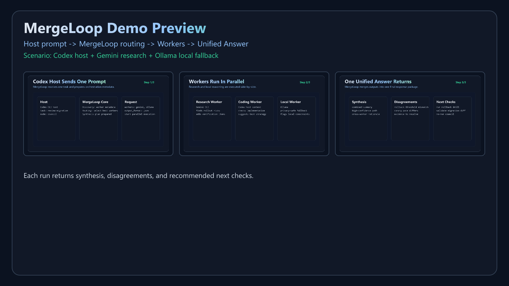
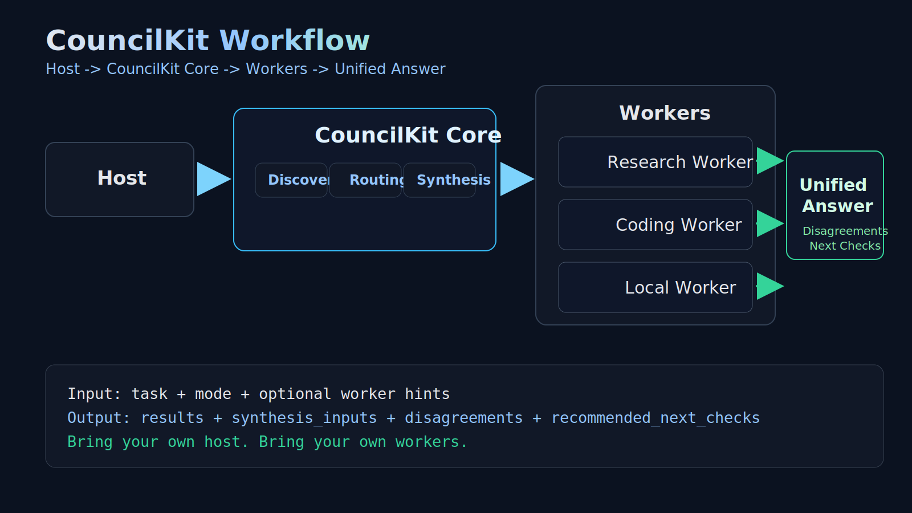
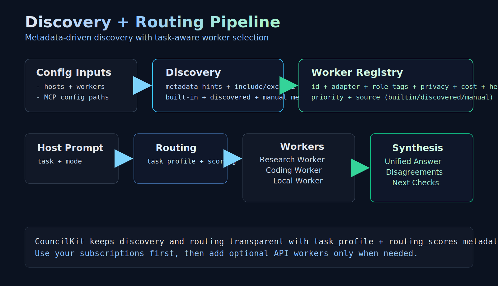
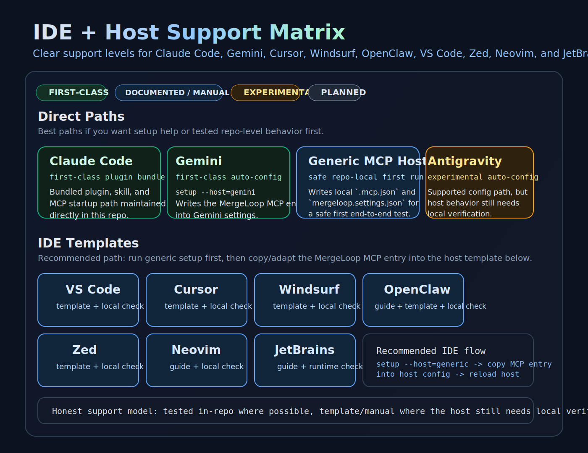
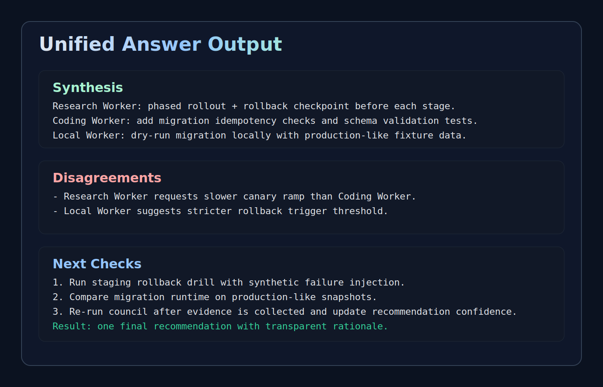

# MergeLoop


## One prompt. Many models. One answer.

MergeLoop is a host-agnostic model council for MCP, CLI, and optional API workers. It routes tasks across selected workers and returns one unified answer.

Bring your own host. Bring your own workers. Use your subscriptions first, then add API adapters only when you need them. MergeLoop is not Claude-only, not limited to fixed built-in workers, and not a quota bypass. Provider and host quotas still apply.



Static fallback: [docs/demo/hero-static.svg](./docs/demo/hero-static.svg)

Quick links: [Quickstart](./docs/quickstart.md) · [Setup](./docs/setup.md) · [Gemini](./docs/gemini.md) · [Ollama](./docs/ollama.md) · [Integrations](./integrations/README.md)

### Get Started

```bash
npm ci
npm run build
npm run setup
npm run doctor
```

Most common local stack: Gemini + Ollama first, Codex when you want code-level review.

## Interactive Setup (Recommended)

Run:

```bash
npm run setup
```

Setup wizard features:

- detects local CLIs (`codex`, `gemini`, `ollama`, `claude`)
- helps choose host + workers + routing style
- writes/merges `mergeloop.settings.json`
- can auto-merge `mergeloop` MCP entry into selected host config
- creates timestamped backups before file changes
- runs `doctor` + `smoke` at the end (unless dry-run)

Auto-config status:

- first-class auto-config: Gemini settings
- experimental auto-config: Antigravity config
- documented/manual via template write: generic MCP JSON
- manual start command: Claude Code plugin path

Useful flags:

```bash
npm run setup -- --dry-run
npm run setup -- --yes --host=gemini --workers=gemini,ollama,codex
```

Docs:

- [docs/setup.md](./docs/setup.md)
- [docs/host-autoconfig.md](./docs/host-autoconfig.md)
- [docs/rollback.md](./docs/rollback.md)

## Migration From CouncilKit

MergeLoop is the new name for CouncilKit.

- new installs should use `mergeloop.settings.json`, `MERGELOOP_CONFIG`, `~/.mergeloop/config.json`, and the MCP server id `mergeloop`
- legacy aliases are still recognized for migration:
  - `councilkit.settings.json`
  - `COUNCILKIT_CONFIG`
  - `~/.councilkit/config.json`
  - legacy MCP ids such as `councilkit` and `council-hub`
- rerunning `npm run setup` will write the new MergeLoop naming and replace legacy MCP ids in supported host config files

## Why This Exists

Most teams already pay for multiple model subscriptions and run local tools, but still operate them one-at-a-time.
MergeLoop adds a single orchestration layer so one prompt can produce:

- parallel worker outputs
- explicit agreement/disagreement signals
- a merged recommendation and next verification checks

## What MergeLoop Is

- An MCP-native orchestration runtime (`mergeloop-hub`)
- A host-agnostic middle layer (not tied to one editor/agent)
- A worker registry with discovery + routing heuristics
- A runtime that can combine MCP servers, CLI workers, local runtimes, and optional API adapters
- A bundled Claude Code plugin path in this repo (without making Claude the only host path)

## What Makes MergeLoop Different?

Many workflows force everything through one provider or one model path.
MergeLoop keeps hosts and workers separate, so one request can combine:

- MCP-connected workers
- CLI workers (for example Codex CLI and Gemini CLI)
- local runtimes like Ollama
- optional API workers when you choose to add them

This is practical for teams already paying for subscriptions and running local tooling.
You can start subscription-first and local-first, then add API adapters only if and when they help.

## What MergeLoop Is Not

- Not a quota bypass
- Not a credential harvester
- Not a guarantee of universal IDE/agent compatibility
- Not an official adapter for providers that are only listed as planned

## How It Works

1. A host sends `task`, `mode`, and optional worker hints to `mergeloop_run`.
2. MergeLoop builds a worker registry from built-ins, config-defined workers, and discovery candidates.
3. Router scores workers against task profile (coding/research/planning/privacy).
4. Selected workers run in parallel.
5. MergeLoop returns one output bundle:
   `results`, `synthesis_inputs`, `disagreements`, `recommended_next_checks`.

Workflow visuals:
- [docs/demo/workflow.svg](./docs/demo/workflow.svg)
- [docs/demo/discovery-routing.svg](./docs/demo/discovery-routing.svg)

## Hosts vs Workers

- Host: where the user starts work (Claude Code, generic MCP host, CLI wrapper).
- Worker: execution target MergeLoop calls (Codex CLI, Gemini CLI, Ollama, custom CLI/MCP/API worker definitions).
- MergeLoop Core: the orchestration layer between host and workers.
- Worker selection is registry + routing based, not locked to a fixed worker list.

Details: [docs/architecture.md](./docs/architecture.md)

## Supported Today / Manual / Experimental / Planned

### First-Class

- MergeLoop core runtime + MCP server
- Claude Code plugin bundle in this repo
- Built-in CLI workers: `codex`, `gemini`, `local`, `ollama`

### Manual (Documented Templates)

- VS Code, Cursor, Windsurf, OpenClaw templates
- Zed, Neovim, JetBrains manual integration docs
- Generic MCP host registration

### Experimental

- API worker model in config (not the default path)
- Community worker templates requiring local validation

### Planned

- Additional first-class host adapters beyond current plugin bundle
- Additional verified worker adapters when implemented and tested
- Perplexity host path only after a real tested adapter lands

Support matrix visual: [docs/demo/support-matrix.svg](./docs/demo/support-matrix.svg)

## Quickstart (Windows/macOS/Linux)

Requirements:
- Node.js 20+
- At least one worker CLI installed/authenticated (for example `codex`, `gemini`, or `ollama`)

```bash
npm ci
npm test
npm run build
npm run smoke
```

Check environment:

```bash
npm run doctor
```

If `doctor` fails only because vendor CLIs are missing, install/auth those CLIs or disable those workers in config.
Missing worker CLIs are external local dependency checks, not MergeLoop build failures.

Windows note: native Node is supported. WSL is recommended if your worker CLIs are Linux-first.

## Fast Local Test: Codex + Gemini + Ollama

1. Install/build:

```bash
npm ci
npm run build
npm run smoke
```

2. Ensure Gemini CLI is authenticated (run `gemini` once if needed to complete login/auth).
3. Ensure Ollama is running and a model is available:

```bash
ollama pull qwen3:latest
ollama serve
```

4. Validate local workers:

```bash
npm run doctor
```

5. Add MergeLoop to Gemini MCP config (`~/.gemini/settings.json`):

```json
{
  "mcpServers": {
    "cloudrun": {
      "command": "npx",
      "args": ["-y", "@google-cloud/cloud-run-mcp"]
    },
    "mergeloop": {
      "command": "node",
      "args": ["D:/Ideas/MergeLoop/dist/server.js"]
    }
  }
}
```

6. Restart/reload Gemini, then prompt:

```text
Use mergeloop.mergeloop_run in council mode with workers gemini, local, codex.
Task: review this migration plan and return disagreements plus next checks.
```

Guides:
- [docs/gemini.md](./docs/gemini.md)
- [docs/ollama.md](./docs/ollama.md)

## Claude Code Quickstart

```bash
claude --plugin-dir .
```

From the parent directory instead:

```bash
claude --plugin-dir ./MergeLoop
```

Plugin files:
- [`.claude-plugin/plugin.json`](./.claude-plugin/plugin.json)
- [`.mcp.json`](./.mcp.json)
- [`skills/run/SKILL.md`](./skills/run/SKILL.md)

## Other Host Integration Paths

### Generic MCP Host

```json
{
  "mcpServers": {
    "mergeloop-hub": {
      "command": "node",
      "args": ["/absolute/path/to/MergeLoop/dist/server.js"]
    }
  }
}
```

### Gemini Host Path (documented/manual)

Gemini MCP settings file: `~/.gemini/settings.json`

Guide:
- [docs/gemini.md](./docs/gemini.md)

### VS Code (documented/manual)

Template: [integrations/vscode/mcp.json](./integrations/vscode/mcp.json)

### Cursor (documented/manual)

Template: [integrations/cursor/mcp.json](./integrations/cursor/mcp.json)

### Windsurf (documented/manual)

Template: [integrations/windsurf/mcp_config.json](./integrations/windsurf/mcp_config.json)

### OpenClaw (documented/manual)

Guides/templates:
- [integrations/openclaw/README.md](./integrations/openclaw/README.md)
- [integrations/openclaw/mcp-server-template.json](./integrations/openclaw/mcp-server-template.json)

### Zed (documented/manual)

Template: [integrations/zed/settings.json](./integrations/zed/settings.json)

### Neovim (documented/manual)

Guide: [integrations/neovim/README.md](./integrations/neovim/README.md)

### JetBrains (documented/manual)

Guide: [integrations/jetbrains/README.md](./integrations/jetbrains/README.md)

Manual/template integrations require local host verification; see [integrations/README.md](./integrations/README.md) for tested scope and known-good local test steps.

## Configuration Model

Primary file: [`mergeloop.settings.json`](./mergeloop.settings.json)

Top-level sections:
- `active_host`
- `hosts`
- `workers`
- `discovery`
- `routing`
- legacy compatibility fields (`codex_command`, `worker_registry`, `custom_workers`, etc.)

Read more:
- [docs/configuration.md](./docs/configuration.md)
- [docs/discovery.md](./docs/discovery.md)
- [docs/routing.md](./docs/routing.md)
- [docs/ollama.md](./docs/ollama.md)
- [docs/gemini.md](./docs/gemini.md)

## How Discovery Works

- Reads configured MCP config files and CLI candidate lists.
- Requires explicit metadata hints when `require_worker_metadata` is enabled.
- Applies include/exclude/disabled rules.
- Merges built-in, discovered, and manual workers into one typed registry.

## How Routing Works

- Classifies each task (coding/research/planning/sensitive/general).
- Scores workers by role tags, privacy mode, cost hint, fallback order, and health.
- Selects one worker (`single`) or top workers (`council`) without blasting every worker by default.

## `mergeloop_run` Example

```json
{
  "task": "Review this migration plan and list rollback risks.",
  "mode": "council",
  "workers": ["codex", "gemini", "ollama"],
  "output_format": "json"
}
```

### Example Unified Output (short)

```json
{
  "results": [{ "worker_name": "codex" }, { "worker_name": "gemini" }, { "worker_name": "ollama" }],
  "synthesis_inputs": [{ "worker_name": "codex" }, { "worker_name": "gemini" }, { "worker_name": "ollama" }],
  "disagreements": ["gemini flagged rollback risk not covered by codex"],
  "recommended_next_checks": ["run rollback drill in staging", "verify migration checksum diff"]
}
```

## Why Not Just Use One Model?

For low-risk tasks, one model is often enough.
For higher-impact work, council mode gives cross-checking, disagreement visibility, and concrete verification steps before action.

## What Happens If Claude Is Capped?

Use another configured host path.
MergeLoop is host-agnostic, but each host and worker still has its own limits and policies.

## Use Your Subscriptions First, API Optional

MergeLoop is designed for subscription-first and local-runtime-first workflows.
Use your subscriptions first. Add APIs only when you want or need them.
For many workflows, direct API setup is optional, not required.
Host and provider quotas still apply.

## Perplexity / Future Hosts

Perplexity is not listed as supported in this repo today.
It is only a planned target until a tested adapter is implemented and documented here.

## Ollama Local Path

Ollama is a first-class local worker in MergeLoop.
It can be used for privacy-sensitive tasks and as a fallback in council mode.
Default public config uses `local` as a compatibility alias backed by `local_command: "ollama run qwen3:latest"`.

Guide: [docs/ollama.md](./docs/ollama.md)

## Daena Add-On Mode

MergeLoop can run as an orchestration middle layer for Daena.

1. Daena sends one task to `mergeloop_run`.
2. MergeLoop routes and runs selected workers.
3. Daena consumes disagreements and next-check suggestions.

Examples:
- [examples/host-daena-addon-mode.json](./examples/host-daena-addon-mode.json)
- [examples/daena-addon.md](./examples/daena-addon.md)

## Security, Trust, and Compliance

- Worker CLIs must be installed/authenticated separately.
- MergeLoop does not scrape credentials or imitate vendor auth.
- MergeLoop orchestrates workers; it does not mint extra quota.
- Discovery is metadata-driven; not every MCP server is automatically treated as a worker.

See:
- [SECURITY.md](./SECURITY.md)
- [LEGAL_COMPLIANCE.md](./LEGAL_COMPLIANCE.md)
- [docs/security.md](./docs/security.md)

## Limitations and Known Constraints

- Worker quality and uptime depend on local environment and external CLIs.
- Some host integrations are manual templates, not end-to-end verified adapters.
- API worker adapter is configuration-ready but not the core runtime path.
- Capability metadata is explicit; MergeLoop does not infer full behavior from arbitrary MCP servers.

## Demo Assets







Storyboard demo:
- [docs/demo/storyboard/index.html](./docs/demo/storyboard/index.html)
- regenerate with `npm run demo:render`
- export PNG demo assets cross-platform with `npm run demo:export-png`

Static demo preview:
- [assets/social-preview.png](./assets/social-preview.png)

## Contributing and Roadmap

- [CONTRIBUTING.md](./CONTRIBUTING.md)
- [ROADMAP.md](./ROADMAP.md)
- [CHANGELOG.md](./CHANGELOG.md)
- [docs/release-checklist.md](./docs/release-checklist.md)

## License

Apache-2.0. See [LICENSE](./LICENSE).
